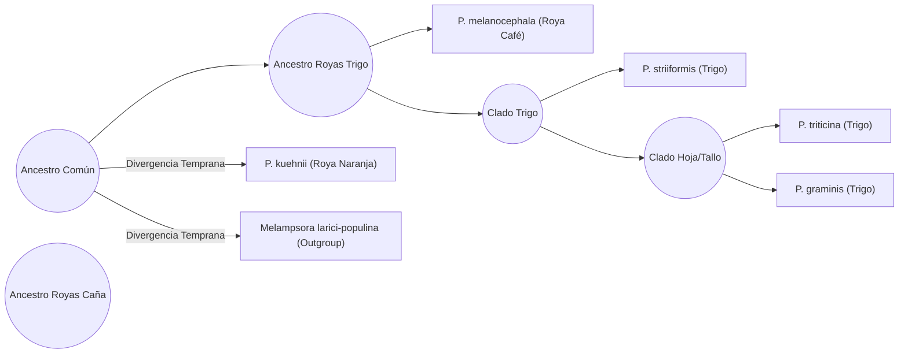

# CAPÍTULO: METODOLOGÍA

## Materiales y Métodos (Bioinformática)

### 1. Anotación Funcional y Mapeo Ontológico
La anotación funcional de los genomas ensamblados (*Puccinia melanocephala* y *Puccinia kuehnii*) se realizó utilizando **eggNOG-mapper v2**. Se empleó el algoritmo de alineamiento rápido **DIAMOND** para comparar el proteoma predicho de ambas especies contra la base de datos de ortología de EggNOG. A partir de los resultados, se extrajeron las Categorías Funcionales Ortólogas (COG) y los términos de Gene Ontology (GO). Para evitar el ruido estadístico de la masiva redundancia genómica, los conteos se normalizaron a nivel de "Familias Base" (Orthologous Groups). Adicionalmente, los términos GO crudos fueron mapeados a **GO Slim** utilizando el DAG (Directed Acyclic Graph) del archivo `goslim_generic.obo` para consolidar las funciones biológicas en categorías macro.

### 2. Genómica Comparativa y Arquitectura de Sintenia
Para evaluar la conservación del orden génico (sintenia) entre ambas especies, se realizó un alineamiento de todos contra todos (All-vs-All) del proteoma utilizando **BLASTp** (e-value < 1e-10). Las coordenadas genómicas (archivo GFF3) y el resultado del BLASTp sirvieron como input para **MCScanX**. Se configuró un parámetro de estricta colinealidad (`MATCH_SIZE=5`) para definir fragmentos cromosómicos conservados (bloques sinténicos) y filtrar transposones aislados. 

### 3. Identidad Genómica Global (ANI)
La distancia taxonómica y estructural de los genomas completos a nivel de nucleótidos se calculó utilizando el algoritmo **fastANI**. Esta herramienta fragmentó los genomas para buscar regiones homólogas continuas, arrojando dos métricas fundamentales: la Fracción de Alineamiento (AF), que cuantifica el porcentaje de masa genómica compartida, y la Identidad Promedio de Nucleótidos (ANI), que mide la similitud exacta en dichas regiones conservadas.

### 4. Selección Natural (Ka/Ks) y Reloj Molecular
La presión evolutiva se calculó analizando los pares de genes ortólogos anclados dentro de los bloques de sintenia. Se determinó la proporción de sustituciones no sinónimas (Ka) sobre las sustituciones sinónimas (Ks). Las familias génicas con un radio Ka/Ks > 1 fueron clasificadas bajo selección positiva diversificadora (hiper-mutantes adaptativas), mientras que aquellas con Ka/Ks < 1 se catalogaron bajo selección purificadora estricta. 
Para el cálculo del tiempo de divergencia evolutiva, se empleó la tasa de mutaciones sinónimas (Ks global) como reloj molecular. Se aplicó la ecuación de Especiación $T = Ks / 2r$, asumiendo una tasa de mutación fúngica estándar para patógenos basidiomicetos de $r = 1.5 \times 10^{-8}$ sustituciones por sitio por año.

### 5. Análisis Filogenético y Topología Evolutiva
Para determinar la posición evolutiva del complejo patogénico de la caña de azúcar frente a las royas de los cereales modernos, se extrajeron secuencias ortólogas altamente conservadas (Complejo Arp2/3) de 6 especies (*P. melanocephala*, *P. kuehnii*, *P. graminis*, *P. triticina*, *P. striiformis*, y *Melampsora larici-populina* como outgroup). El alineamiento múltiple de secuencias se ejecutó con **MAFFT**, seguido de la construcción del árbol filogenético bajo el criterio de Máxima Verosimilitud (Maximum Likelihood) utilizando **FastTree**. El cronograma final con la escala de tiempo de divergencia fue renderizado algorítmicamente mediante la librería gráfica `matplotlib` en Python.

### 6. Modelado de Elementos Transponibles y Arquitectura a Dos Velocidades
Para determinar el impacto estructural de las secuencias repetitivas en la expansión genómica observada, se implementó un pipeline de descubrimiento *De Novo*. Se construyeron bibliotecas de consenso de familias de Elementos Transponibles (TEs) de manera independiente para cada genoma utilizando el algoritmo heurístico de **RepeatModeler**. Este programa escaneó los ensamblajes genómicos para identificar, agrupar y extraer las secuencias molde de las familias invasoras.

Para cuantificar la carga transposónica absoluta (la cantidad real de ADN genómico ocupado por estas secuencias), las bibliotecas de consenso fueron mapeadas exhaustivamente de vuelta a sus respectivos genomas totales utilizando el algoritmo **BLASTn** (Basic Local Alignment Search Tool). Las coordenadas de alineamiento resultantes fueron fusionadas para evitar el doble conteo de transposones superpuestos, obteniendo el porcentaje exacto de cobertura repetitiva.

Finalmente, para validar el modelo del "Genoma a Dos Velocidades", se realizó un análisis de topología espacial intergénica. Utilizando la herramienta `closest` de la suite **Bedtools**, se cruzaron las coordenadas físicas de todos los modelos génicos estructurales frente a las coordenadas físicas de los TEs descubiertos. Esto permitió medir la distancia física (en pares de bases) entre la región codificante de cada gen y su elemento móvil más próximo, permitiendo clasificar cuantitativamente el genoma en un compartimiento estable (genes aislados en zonas libres de TEs) y un compartimiento accesorio plástico (genes directamente solapados o estrechamente flanqueados por la actividad transposónica).

---

# CAPÍTULO: RESULTADOS Y DISCUSIÓN

# CAPÍTULO: METODOLOGÍA

## Materiales y Métodos (Bioinformática)

### 1. Anotación Funcional y Mapeo Ontológico
La anotación funcional de los genomas ensamblados (*Puccinia melanocephala* y *Puccinia kuehnii*) se realizó utilizando **eggNOG-mapper v2**. Se empleó el algoritmo de alineamiento rápido **DIAMOND** para comparar el proteoma predicho de ambas especies contra la base de datos de ortología de EggNOG. A partir de los resultados, se extrajeron las Categorías Funcionales Ortólogas (COG) y los términos de Gene Ontology (GO). Para evitar el ruido estadístico de la masiva redundancia genómica, los conteos se normalizaron a nivel de "Familias Base" (Orthologous Groups). Adicionalmente, los términos GO crudos fueron mapeados a **GO Slim** utilizando el DAG (Directed Acyclic Graph) del archivo `goslim_generic.obo` para consolidar las funciones biológicas en categorías macro.

### 2. Genómica Comparativa y Arquitectura de Sintenia
Para evaluar la conservación del orden génico (sintenia) entre ambas especies, se realizó un alineamiento de todos contra todos (All-vs-All) del proteoma utilizando **BLASTp** (e-value < 1e-10). Las coordenadas genómicas (archivo GFF3) y el resultado del BLASTp sirvieron como input para **MCScanX**. Se configuró un parámetro de estricta colinealidad (`MATCH_SIZE=5`) para definir fragmentos cromosómicos conservados (bloques sinténicos) y filtrar transposones aislados. 

### 3. Identidad Genómica Global (ANI)
La distancia taxonómica y estructural de los genomas completos a nivel de nucleótidos se calculó utilizando el algoritmo **fastANI**. Esta herramienta fragmentó los genomas para buscar regiones homólogas continuas, arrojando dos métricas fundamentales: la Fracción de Alineamiento (AF), que cuantifica el porcentaje de masa genómica compartida, y la Identidad Promedio de Nucleótidos (ANI), que mide la similitud exacta en dichas regiones conservadas.

### 4. Selección Natural (Ka/Ks) y Reloj Molecular
La presión evolutiva se calculó analizando los pares de genes ortólogos anclados dentro de los bloques de sintenia. Se determinó la proporción de sustituciones no sinónimas (Ka) sobre las sustituciones sinónimas (Ks). Las familias génicas con un radio Ka/Ks > 1 fueron clasificadas bajo selección positiva diversificadora (hiper-mutantes adaptativas), mientras que aquellas con Ka/Ks < 1 se catalogaron bajo selección purificadora estricta. 
Para el cálculo del tiempo de divergencia evolutiva, se empleó la tasa de mutaciones sinónimas (Ks global) como reloj molecular. Se aplicó la ecuación de Especiación $T = Ks / 2r$, asumiendo una tasa de mutación fúngica estándar para patógenos basidiomicetos de $r = 1.5 \times 10^{-8}$ sustituciones por sitio por año.

### 5. Análisis Filogenético y Topología Evolutiva
Para determinar la posición evolutiva del complejo patogénico de la caña de azúcar frente a las royas de los cereales modernos, se extrajeron secuencias ortólogas altamente conservadas (Complejo Arp2/3) de 6 especies (*P. melanocephala*, *P. kuehnii*, *P. graminis*, *P. triticina*, *P. striiformis*, y *Melampsora larici-populina* como outgroup). El alineamiento múltiple de secuencias se ejecutó con **MAFFT**, seguido de la construcción del árbol filogenético bajo el criterio de Máxima Verosimilitud (Maximum Likelihood) utilizando **FastTree**. El cronograma final con la escala de tiempo de divergencia fue renderizado algorítmicamente mediante la librería gráfica `matplotlib` en Python.

---

# CAPÍTULO: RESULTADOS Y DISCUSIÓN

# Análisis Estructural y Funcional de los Genomas de *Puccinia melanocephala* y *Puccinia kuehnii*

---

## 1. Metodología Bioinformática

### 1.1 Material biológico y secuenciación
Se trabajó con aislamientos monosóricos (derivados de una sola pústula), multiplicados por reinoculación en invernadero:

| Especie | Enfermedad | Cultivar de origen | Muestra | Esporas colectadas |
| :--- | :--- | :--- | :--- | :--- |
| *Puccinia melanocephala* | Roya Café | CC 85-92 | RCM1 | 331 mg |
| *Puccinia kuehnii* | Roya Naranja | CC 01-1940 | RNM2 | 680 mg |

El ADN se extrajo con el kit Omniprep, con ruptura mecánica de las uredosporas. La secuenciación se realizó con lecturas largas **PacBio HiFi** (librería Long Plex, fragmentos de 5–7 kb) y lecturas cortas **Illumina**. No fue posible obtener datos Hi-C, porque la cantidad de esporas disponible era inferior a la requerida.

### 1.2 Ensamblaje y depuración
1. **Control de calidad:** remoción de adaptadores con HiFiAdapterFilt.
2. **Tamaño del genoma:** estimación por k-meros (k = 31) con GenomeScope2.
3. **Ensamblaje:** hifiasm, que produce un ensamblaje primario y dos haplotipos parciales (hap1 y hap2).
4. **Contaminantes:** asignación taxonómica de los contigs con BlobToolKit (contenido GC, cobertura de lecturas y homología). Se conservaron únicamente los contigs asignados al género *Puccinia*.
5. **Completitud:** BUSCO con el linaje pucciniomycetes (n = 3,329).

El análisis posterior se realizó sobre el **haplotipo 2 depurado** de cada especie.

### 1.3 Anotación estructural y funcional
La predicción de genes se realizó con **BRAKER**, que integra los modelos de AUGUSTUS y GeneMark, usando evidencia proteica. Las estadísticas estructurales se calcularon a partir de los archivos GFF3; cuando un gen tiene varias isoformas, se usó como representante el transcrito con la CDS más larga. La asignación de roles biológicos se realizó con **eggNOG-mapper v2.1.13** (ámbito taxonómico Fungi).

> **Pendiente de confirmar:** la versión de BRAKER y si el genoma se enmascaró (*soft-masking*) antes de la predicción. Los FASTA depurados disponibles no están enmascarados.

## 2. Resultados: Ensamblaje, Anotación Estructural y Carga Génica

### 2.1 Ensamblaje y Anotación Estructural

#### 2.1.1 Tamaño del genoma estimado por k-meros

**Tabla 2.1a: Perfil de k-meros (GenomeScope2, k = 31)**

| Parámetro | Roya Café (RCM1) | Roya Naranja (RNM2) |
| :--- | :--- | :--- |
| Tamaño haploide estimado | 240.2 Mb | 210.3 Mb |
| Secuencia única | 60.0% | 70.3% |
| Secuencia repetitiva | 40.0% | 29.7% |
| Cobertura de k-meros | 32.8× | 30× |
| Tasa de error | 1.07% | 1.51% |
| Tasa de duplicación | 1.42 | 1.35 |

La Roya Café presenta un genoma haploide estimado 14% mayor que el de la Roya Naranja y una fracción repetitiva más alta (40% frente a 30%).

#### 2.1.2 Ensamblaje

**Tabla 2.1b: Ensamblajes de hifiasm antes de la depuración**

| Ensamblaje | Métrica | Roya Café (RCM1) | Roya Naranja (RNM2) |
| :--- | :--- | :--- | :--- |
| **Primario** | Contigs | 6,903 | 5,969 |
| | Longitud total | 501 Mb | 359.7 Mb |
| | N50 | 1,157 kb | 473 kb |
| **Haplotipo 1** | Contigs | 8,904 | 6,988 |
| | Longitud total | 460 Mb | 347.1 Mb |
| | N50 | 424 kb | 234 kb |
| **Haplotipo 2** | Contigs | 4,373 | 2,926 |
| | Longitud total | 422 Mb | 305.3 Mb |
| | N50 | 556 kb | 274 kb |
| | Contig más largo | 5.92 Mb | 2.05 Mb |

El haplotipo 2 fue el más contiguo en ambas especies y se seleccionó para la depuración y la anotación.

#### 2.1.3 Depuración de contaminantes

**Tabla 2.1c: Haplotipo 2 antes y después de la depuración**

| Métrica | Roya Café (RCM1) | Roya Naranja (RNM2) |
| :--- | :--- | :--- |
| Haplotipo 2 sin depurar | 422 Mb; 4,373 contigs | 305.3 Mb; 2,926 contigs |
| **Ensamblaje depurado (solo *Puccinia*)** | **322.68 Mb; 1,455 contigs** | **267.54 Mb; 1,557 contigs** |
| N50 del ensamblaje depurado | 712.3 kb | 310.1 kb |
| Contig más largo | 5.92 Mb | 2.05 Mb |
| Contenido GC | 38.6% | 32.7% |
| Bases indeterminadas (N) | 0 | 0 |
| Secuencia removida | ~99 Mb (23.5%) | ~38 Mb (12.4%) |
| Contigs removidos | 2,918 | 1,369 |

**Tabla 2.1d: Composición taxonómica del haplotipo 2 de Roya Naranja antes de la depuración (BlobToolKit)**

| Grupo taxonómico | Contigs | Longitud |
| :--- | :--- | :--- |
| Basidiomycota | 2,330 | 288 Mb |
| Actinomycetota | 381 | 9.06 Mb |
| Streptophyta (planta) | 69 | 4.62 Mb |
| Sin asignación | 64 | 0.87 Mb |
| Arthropoda | 17 | 0.61 Mb |
| Ascomycota | 18 | 0.57 Mb |
| Mucoromycota | 15 | 0.22 Mb |
| Chytridiomycota | 14 | 0.18 Mb |
| Uroviricota | 5 | 0.09 Mb |
| Otros | 15 | 0.97 Mb |

Dentro de Basidiomycota se conservó únicamente el grupo principal asignado a *Puccinia* (GC cercano a 32%), lo que explica la diferencia entre los 288 Mb de Basidiomycota y los 267.54 Mb finales.

> **Pendiente:** la tabla equivalente para Roya Café. La diapositiva de contaminación de RCM1 muestra la gráfica de RNM2, por lo que no se dispone de la composición previa a la depuración.

#### 2.1.4 Completitud de los ensamblajes

**Tabla 2.1e: BUSCO (linaje pucciniomycetes, n = 3,329)**

| Categoría | Roya Café, hap1 | Roya Café, hap2 | Roya Naranja, hap2 |
| :--- | :--- | :--- | :--- |
| **Completos** | 93.84% (3,124) | 93.42% (3,110) | 93.09% (3,099) |
| ↳ Copia única | 87.29% (2,906) | 87.62% (2,917) | 90.63% (3,017) |
| ↳ Duplicados | 6.55% (218) | 5.80% (193) | 2.46% (82) |
| Fragmentados | 1.32% (44) | 1.44% (48) | 1.53% (51) |
| Ausentes | 4.84% (161) | 5.14% (171) | 5.38% (179) |

Los ensamblajes de ambas especies recuperan cerca del 93% de los ortólogos conservados, por lo que su espacio génico es comparable. La Roya Café presenta 2.4 veces más ortólogos duplicados que la Roya Naranja (5.80% frente a 2.46%).

#### 2.1.5 Relación entre el ensamblaje y el tamaño estimado

**Tabla 2.1f: Ensamblaje depurado frente al tamaño haploide estimado**

| Métrica | Roya Café | Roya Naranja |
| :--- | :--- | :--- |
| Tamaño haploide estimado (k-meros) | 240.2 Mb | 210.3 Mb |
| Ensamblaje depurado | 322.68 Mb | 267.54 Mb |
| Relación ensamblaje / estimado | 1.34 | 1.27 |

Ambos ensamblajes superan el tamaño haploide estimado. Esto es esperable en genomas dicarióticos ensamblados sin datos Hi-C: parte del segundo haplotipo puede permanecer sin colapsar, y las repeticiones de alta copia tienden a subestimarse en el análisis de k-meros.

#### 2.1.6 Anotación estructural

**Tabla 2.1g: Estadísticas de la anotación estructural (BRAKER)**

| Métrica | Roya Café (*P. melanocephala*) | Roya Naranja (*P. kuehnii*) |
| :--- | :--- | :--- |
| **Genes predichos (loci)** | **32,412** | **15,690** |
| **Transcritos** | 33,999 | 16,432 |
| Genes con isoformas alternativas | 1,477 (4.6%) | 683 (4.4%) |
| Densidad génica | 100.4 genes/Mb | 58.6 genes/Mb |
| Longitud de gen, media (mediana) | 1,229 (857) pb | 2,288 (1,078) pb |
| Longitud de CDS, media (mediana) | 970 (645) pb | 1,019 (609) pb |
| Longitud de proteína, media (mediana) | 322 (214) aa | 339 (202) aa |
| Exones por gen, media (mediana) | 3.33 (2) | 4.01 (3) |
| Genes de un solo exón | 8,796 (27.1%) | 3,341 (21.3%) |
| Longitud de exón, media (mediana) | 292 (183) pb | 254 (150) pb |
| Longitud de intrón, media (mediana) | 111 (84) pb | 391 (107) pb |
| Fracción codificante del genoma | 31.40 Mb (9.73%) | 15.98 Mb (5.97%) |
| Contigs con al menos un gen | 1,265 de 1,455 | 1,415 de 1,557 |
| Transcritos completos (codón de inicio y de parada) | 99.1% | 97.8% |
| Proteínas menores de 100 aa | 5,072 (15.6%) | 2,718 (17.3%) |

La anotación predijo 32,412 genes en *P. melanocephala* y 15,690 en *P. kuehnii*. La Roya Café presenta 2.07 veces más genes en un ensamblaje solo 1.21 veces mayor, lo que eleva su densidad génica de 58.6 a 100.4 genes/Mb. La arquitectura de los genes es similar entre especies (medianas de proteína de 214 y 202 aa, y de 2 y 3 exones por gen), aunque los intrones de la Roya Naranja son en promedio más largos.

#### 2.1.7 Redundancia de los modelos génicos

**Tabla 2.1h: Indicadores de redundancia**

| Indicador | Roya Café | Roya Naranja |
| :--- | :--- | :--- |
| Ortólogos BUSCO duplicados | 5.80% | 2.46% |
| Genes en bloques colineales casi idénticos dentro del mismo genoma | 2,399 (7.4%) | 249 (1.6%) |
| Genes con dominios de elementos transponibles | 3,979 (12.3%) | 341 (2.2%) |
| Genes con proteína idéntica a la de otro gen | 2,864 (8.8%) | 712 (4.5%) |
| Genes con al menos un parálogo de identidad ≥ 98% | 7,212 (22.3%) | 1,077 (6.9%) |

El exceso de genes en la Roya Café debe interpretarse con cautela, porque tiene tres componentes:

1. **Redundancia residual entre haplotipos (cerca del 6–7% de los genes).** Dos medidas independientes coinciden: los BUSCO duplicados (5.80%) y los genes ubicados en bloques colineales casi idénticos dentro del mismo genoma (7.4%; identidad proteica mediana de 99.2%).
2. **Modelos derivados de elementos transponibles (12.3% de los genes).** Son más de cinco veces más frecuentes que en la Roya Naranja (2.2%).
3. **Familias multicopia.** El 22.3% de los genes tiene al menos un parálogo con identidad ≥ 98%, frente al 6.9% en la Roya Naranja.

Por tanto, el número de genes de *P. melanocephala* no es directamente comparable con el de *P. kuehnii* sin descontar estas copias.

#### 2.1.8 Síntesis

- Se obtuvieron ensamblajes depurados de 322.68 Mb (Roya Café) y 267.54 Mb (Roya Naranja), ambos con cerca del 93% de completitud BUSCO.
- El genoma de la Roya Café es mayor y más repetitivo, según el perfil de k-meros (40% frente a 30% de secuencia repetitiva) y el tamaño del ensamblaje.
- La Roya Café tiene el doble de genes predichos (32,412 frente a 15,690). Una parte de la diferencia corresponde a modelos derivados de transposones, a familias multicopia y, en menor medida, a redundancia entre haplotipos.

#### 2.1.9 Pendientes

| Pendiente | Para qué se necesita |
| :--- | :--- |
| BUSCO sobre los proteomas predichos (modo proteínas) | El BUSCO disponible mide los ensamblajes, no la anotación. |
| Versión de BRAKER y enmascaramiento del genoma | Completar los métodos; un genoma sin enmascarar infla los modelos derivados de transposones. |
| Composición taxonómica de Roya Café antes de la depuración | Completar la Tabla 2.1d para ambas especies. |
| Confirmar sobre qué archivo se corrió el BUSCO de cada especie | Precisar si corresponde al haplotipo 2 antes o después de la depuración. |

#### 2.1.10 Origen de los datos

| Resultado | Fuente |
| :--- | :--- |
| Perfil de k-meros, ensamblajes de hifiasm, BlobToolKit y BUSCO | Presentación ICSB 2025 (`Rust_assembly_Presentation_ISCB_2025_final_version.pptx`) |
| Tamaño, contigs, N50 y GC de los ensamblajes depurados | `puccinia_only_BR.fa` y `puccinia_clean_OR.fa` |
| Estadísticas de la anotación estructural | `braker_BR.gff3` y `braker_OR.gff3` |
| Genes con dominios de transposón | `braker_eggnog_BR_2.emapper.annotations` y `braker_eggnog_OR_2.emapper.annotations` |
| Proteínas idénticas | `braker_BR.aa` y `braker_OR.aa` |
| Parálogos con identidad ≥ 98% | `royas.blast` |
| Bloques colineales dentro del mismo genoma | `royas.collinearity` |

Notas sobre la presentación: el conteo de BUSCO fragmentados de Roya Naranja aparece como 179 y corresponde a 51 (1.53% de 3,329); la diapositiva 20 rotula como haplotipo 1 las cifras del haplotipo 2 de Roya Naranja.

**Tabla 2.1i: Resumen de la anotación funcional**
<!-- PENDIENTE: esta tabla conserva las cifras originales (contadas sobre transcritos) y se revisa junto con la sección 2.2. -->

| Métrica Funcional | *Puccinia melanocephala* (Roya Café) | *Puccinia kuehnii* (Roya Naranja) |
| :--- | :--- | :--- |
| **Genes con Anotación Funcional** | 15,683 genes (~46.1%) | 6,741 genes (~41.0%) |
| **Genes Base Únicos (Catálogo sin repeticiones)** | 3,276 genes | 3,178 genes |
| ↳ *Genes base con 1 sola copia estricta* | 2,074 genes | 2,102 genes |
| ↳ *Genes base con múltiples copias (fotocopiados)* | 1,202 genes | 1,076 genes |
| **Total de copias generadas por duplicación** | **13,609 copias** | **4,639 copias** |
| **Transposones Activos (TEs)** | **40 genes únicos** (2,690 copias) | **29 genes únicos** (250 copias) |
| **Genes sin Anotación Funcional (Hipotéticos)**| 18,316 genes (~53.9%) | 9,691 genes (~59.0%) |

### 2.2 Perfil Funcional y Pangenoma (Categorías COG y GO Slim)

Para entender cómo se distribuye la biología de estos hongos más allá del simple conteo estructural, se aislaron los **Genes Base** (Familias únicas u ortólogas), eliminando el ruido provocado por las fotocopias (genes parálogos). Este análisis del pangenoma revela un dato crucial: de las 3,511 familias únicas que conforman la genética de ambas especies, **2,943 familias (el 84%) son compartidas (Core Genoma)**.

*Figura 2.2: Diagrama de Venn ilustrando la intersección de familias biológicas (genes base) entre P. melanocephala y P. kuehnii.*

*Figura 2.2: Diagrama de Venn ilustrando la intersección de familias biológicas (genes base) entre P. melanocephala y P. kuehnii.* 

La Roya Café posee apenas 333 familias exclusivas, mientras que la Roya Naranja tiene 235. Esto indica que ambas especies utilizan esencialmente la misma "caja de herramientas biológicas", y la inflamación del genoma de *P. melanocephala* obedece a una estrategia de duplicación masiva, no a la innovación de nuevas funciones.

**Tabla 2.2a: Distribución Funcional de los Genes Base por Categorías COG**
Al agrupar las familias únicas por su gran categoría metabólica o celular, se evidencia que ambas royas mantienen una complejidad biológica base casi idéntica, destacando la enorme cantidad de "Materia Oscura" (genes especie-específicos sin función conocida en bases de datos).

| Macro-Categoría COG | Categoría Biológica Específica | N° Genes Base (Café) | N° Genes Base (Naranja) |
| :--- | :--- | :--- | :--- |
| **Poco Caracterizados** | **S:** Función Desconocida (Materia oscura) | 1,274 | 1,210 |
| **Procesamiento de Información** | **J:** Traducción y Ribosomas | 225 | 214 |
| **Procesos Celulares y Señalización** | **U:** Tráfico Intracelular y Vesicular | 217 | 207 |
| **Procesos Celulares y Señalización** | **O:** Plegamiento y Modificación de Proteínas | 197 | 213 |
| **Procesamiento de Información** | **A:** Procesamiento de ARN | 185 | 185 |
| **Procesamiento de Información** | **K:** Transcripción (Factores y regulación) | 164 | 157 |
| **Procesos Celulares y Señalización** | **T:** Transducción de Señales (Quinasas) | 142 | 137 |
| **Metabolismo** | **E:** Metabolismo de Aminoácidos | 132 | 126 |
| **Metabolismo** | **G:** Metabolismo de Carbohidratos | 131 | 133 |
| **Metabolismo** | **C:** Producción de Energía (ATP) | 118 | 117 |
| **Metabolismo** | **I:** Metabolismo de Lípidos | 116 | 116 |
| **Procesamiento de Información** | **L:** Replicación y Reparación del ADN | 100 | 98 |
| **Procesos Celulares y Señalización** | **D:** Ciclo Celular y División | 94 | 90 |
| **Procesos Celulares y Señalización** | **M:** Biogénesis de Pared Celular | 30 | 29 |
| **Procesos Celulares y Señalización** | **V:** Defensa Celular (Toxinas y resistencia) | 12 | 13 |

**Tabla 2.2b: Perfil Funcional Específico (Clasificación GO Slim)**
Para corroborar este perfil con la nomenclatura estándar del consorcio de *Gene Ontology*, se mapearon las anotaciones crudas eliminando las jerarquías genéricas redundantes (mediante el subset GO Slim). Los resultados más abundantes confirman la profunda conservación del aparato celular, nuclear y catalítico entre ambos patógenos.

| Aspecto Principal (GO) | Término GO Slim | Descripción de la Función | N° Genes Base (Café) | N° Genes Base (Naranja) |
| :--- | :--- | :--- | :--- | :--- |
| **Componente Celular (CC)** | **GO:0005634** | nucleus *(Núcleo celular)* | 934 | 918 |
| **Función Molecular (MF)** | **GO:0003824** | catalytic activity *(Actividad catalítica general)* | 888 | 880 |
| **Componente Celular (CC)** | **GO:0005739** | mitochondrion *(Mitocondria)* | 530 | 520 |
| **Componente Celular (CC)** | **GO:0005829** | cytosol *(Citosol)* | 432 | 420 |
| **Función Molecular (MF)** | **GO:0016740** | transferase activity *(Actividad transferasa)* | 388 | 375 |
| **Función Molecular (MF)** | **GO:0016787** | hydrolase activity *(Actividad hidrolasa)* | 334 | 338 |
| **Proceso Biológico (BP)** | **GO:0006886** | intracellular protein transport *(Transporte de proteínas)* | 302 | 293 |
| **Función Molecular (MF)** | **GO:0003723** | RNA binding *(Unión a ARN)* | 296 | 285 |
| **Proceso Biológico (BP)** | **GO:0006355** | regulation of transcription *(Regulación de transcripción)* | 288 | 287 |
| **Proceso Biológico (BP)** | **GO:0065003** | protein complex assembly *(Ensamblaje de complejos)* | 283 | 287 |
| **Componente Celular (CC)** | **GO:0005783** | endoplasmic reticulum *(Retículo endoplasmático)* | 271 | 263 |
| **Componente Celular (CC)** | **GO:0005694** | chromosome *(Cromosomas)* | 256 | 247 |
| **Proceso Biológico (BP)** | **GO:0016192** | vesicle-mediated transport *(Transporte por vesículas)* | 219 | 208 |
| **Proceso Biológico (BP)** | **GO:0000278** | mitotic cell cycle *(Ciclo de división celular)* | 215 | 204 |
| **Proceso Biológico (BP)** | **GO:0042254** | ribosome biogenesis *(Creación de ribosomas)* | 213 | 199 |
| **Proceso Biológico (BP)** | **GO:0023052** | signaling *(Señalización celular)* | 179 | 176 |

---

## 3. Genómica Comparativa: Parentesco, Sintenia y Evolución

### 3.1 Filogenia y Especialización en Caña de Azúcar
Para comprender el origen evolutivo del complejo patogénico de la caña de azúcar, se construyó un árbol filogenético de Máxima Verosimilitud (Maximum Likelihood) utilizando el gen ortólogo conservado **Complejo Arp2/3 (Actina)**. Se compararon *P. melanocephala* y *P. kuehnii* frente a las royas del trigo (*P. graminis*, *P. triticina* y *P. striiformis*), utilizando a *Melampsora larici-populina* (roya del álamo) como grupo externo (outgroup).

**Interpretación Evolutiva:**
Contra la creencia clásica de que las dos royas de la caña son especies hermanas inseparables, la topología del árbol demostró un patrón fascinante. Las royas del trigo forman un clado monofilético estricto, pero las royas de la caña están separadas evolutivamente:
1. **Divergencia Basal (*P. kuehnii*):** La Roya Naranja se posiciona como un linaje ancestral muy basal, separándose tempranamente cerca del grupo externo. Esto explica por qué su genoma es tan compacto y conservador (en equilibrio antiguo con su hospedero).
2. **Conexión Plástica (*P. melanocephala*):** La Roya Café se posiciona como una especie hermana más cercana al agresivo clado del trigo. Esto justifica de manera espectacular por qué *P. melanocephala* sufrió una explosión de transposones y un crecimiento genómico caótico: comparte la plasticidad evolutiva reciente y agresiva que caracteriza a los patógenos de los pastos modernos.

### 3.2 Identidad Genómica Global (ANI)
La comparación a nivel de secuencias completas reveló un Porcentaje de Identidad de Nucleótidos Promedio (ANI) del **83.14%** entre ambas royas. Sin embargo, la Fracción de Alineamiento (AF) fue extremadamente baja: apenas el **17.07%**. Esto demuestra que, si bien las zonas conservadas son biológicamente similares (83% idénticas), la abrumadora mayoría del genoma físico (83% restante) no logra alinearse de forma contigua. Esta desconexión estructural es la huella directa de las masivas inserciones de Elementos Transponibles que fragmentaron y reestructuraron por completo la arquitectura del genoma de *P. melanocephala*.

**¿Qué significan biológicamente estos valores?**
Para comprender la magnitud de esta diferencia, podemos imaginar que el genoma de cada hongo es un inmenso manual de instrucciones:
*   **La Fracción de Alineamiento o AF (17.07%):** Significa que solo 17 de cada 100 páginas de ambos manuales hablan de los mismos procesos biológicos. Las 83 páginas restantes del "manual" de la Roya Café están atiborradas de fotocopias redundantes (genes parálogos) y secuencias repetitivas (transposones) que la Roya Naranja simplemente no tiene. Es la prueba irrefutable de la agresiva inflamación de su genoma.
*   **El ANI (83.14%):** Significa que si nos enfocamos en leer *exclusivamente* esas 17 páginas que sí comparten, las "letras" (nucleótidos de ADN) son idénticas en un 83.14%. Tienen "errores ortográficos" (mutaciones puntuales acumuladas), lo cual confirma que son dos especies evolutivamente distintas (ya que dos individuos de la misma especie compartirían más del 95% de las letras).

### 3.3 Cobertura de Mapeo y Mapeo de Variantes (SNPs)
Para evaluar las diferencias exactas a nivel estructural y de pares de bases, se ejecutó un mapeo genómico estricto de genoma completo de *P. melanocephala* contra la referencia de *P. kuehnii* utilizando `minimap2` (asm5) y extracción de variantes con `bcftools`. 

**Tabla 3.3.1. Cobertura de Mapeo Inter-Especie (*P. melanocephala* vs *P. kuehnii*)**

| Métrica de Alineamiento | Volumen (Millones de Bases) | Porcentaje del Genoma |
| :--- | :--- | :--- |
| **Tamaño Total del Genoma (Roya Café)** | 308.1 MB | 100.0% |
| **Bases Mapeadas (Núcleo Conservado)** | 26.6 MB | 8.6% |
| **Bases No Mapeadas (Fracción Divergente)**| 281.5 MB | 91.4% |

Una vez aisladas las regiones homólogas (el 8.6% conservado), se procedió a extraer las mutaciones puntuales exactas que separan a ambas especies:

**Tabla 3.3.2. Variantes genéticas identificadas en el núcleo conservado.**

| Tipo de Variante Genética | Cantidad Detectada |
| :--- | :--- |
| **SNPs** (Mutaciones puntuales) | 170 |
| **INDELs** (Inserciones / Deleciones) | 14 |
| **Total de Variantes** | **184** |

#### Discusión: Comprobación del "Genoma a Dos Velocidades"
Los resultados de cobertura de mapeo representan la confirmación bioinformática absoluta de la hiper-expansión genómica. El hecho de que el **91.4% del genoma de la Roya Café (281.5 MB) no exista ni logre alinear con el de la Roya Naranja**, encaja a la perfección con la abismal pérdida de sintenia reportada previamente (7.9%).

Sin embargo, el descubrimiento de apenas 170 SNPs en el 8.6% de los bloques cromosómicos alineables representa un contraste biológico fascinante. Estos datos respaldan fuertemente la hipótesis estructural del **"Genoma a Dos Velocidades"** en el complejo de royas de la caña de azúcar:

1. **Un compartimiento accesorio (Plástico):** Altamente variable, caótico y masivo (representando más del 91% del ADN divergente). Este compartimento es el responsable de inflar el tamaño del genoma de *P. melanocephala* a más de 308 MB, impulsado presumiblemente por la actividad expansiva de Elementos Transponibles (TEs). *(Nota: La cuantificación y clasificación taxonómica de estas familias de transposones se documentará en el siguiente apartado).*
2. **Un compartimiento núcleo (Core):** Representado por ese 8.6% de regiones conservadas. A pesar del caos estructural a su alrededor, este núcleo es sorprendentemente estable, con tasas de mutación ínfimas (170 SNPs) y fuertemente protegido por selección purificadora (Ka/Ks < 1) para mantener intacta la maquinaria biológica esencial del hongo.

### 3.4 Estructura Poblacional y Diversidad Genética (PCA)
Utilizando la matriz filogenómica de genoma completo (VCF) compuesta por las 44 cepas secuenciadas, se ejecutaron algoritmos de Genética de Poblaciones para cuantificar matemáticamente la distancia evolutiva entre los aislamientos y visualizar su estructura poblacional en un espacio bi-dimensional.

#### Análisis de Componentes Principales (PCA)
El Análisis de Componentes Principales redujo la dimensionalidad de las mutaciones genómicas compartidas, arrojando clústeres genéticos definidos.

**Discusión del PCA:** 
Como se observa en el gráfico, el Componente Principal 1 separa drásticamente al grupo externo (Roya del Álamo). Interesantemente, las 42 cepas mundiales de la Roya del Trigo forman un clado masivo altamente cohesivo (nube azul). La **Roya Café** emerge como un linaje completamente independiente (isla genética aislada), distanciándose radicalmente de los trigos. Esto confirma biológicamente la estricta especialización de hospedero que sufrió este patógeno al adaptarse exclusivamente a *Saccharum*.

### 3.5 Pérdida de Sintenia y Reestructuración Cromosómica
Para medir matemáticamente esta reestructuración, se realizó un análisis de colinealidad (Sintenia). De los más de 50,000 modelos génicos combinados, **solo 4,027 genes (el 7.99%)** conservan un orden espacial compartido en bloques sinténicos. 
La destrucción de más del 92% de la sintenia original confirma que el genoma de la Roya Café no solo "creció" en tamaño, sino que sufrió un evento agresivo de barajado genómico (*shuffling*). Los transposones rompieron y reposicionaron los genes a tal grado que el orden original de los cromosomas del ancestro común quedó completamente pulverizado.

**Tabla 3.2: Resumen Estadístico del Análisis de Sintenia (Colinealidad)**

| Métrica de Arquitectura Espacial | Valor Obtenido | Interpretación Biológica |
| :--- | :--- | :--- |
| **Genes Totales Analizados** | 50,431 genes | Suma combinada de los modelos génicos de ambas royas. |
| **Bloques Sinténicos Conservados** | 300 bloques | Fragmentos cromosómicos que sobrevivieron intactos a la evolución. |
| **Total de Genes Colineales** | 4,027 genes | Genes que mantienen exactamente el mismo orden ortólogo espacial. |
| **Porcentaje de Sintenia Conservada** | **7.99%** | Grado de homología espacial. Extraordinariamente bajo para especies hermanas. |
| **Pérdida/Reestructuración Espacial** | **92.01%** | Fracción del genoma que fue movida, reordenada o rota (*shuffling*), impulsada por TEs. |

*(Nota técnica y parámetros bioinformáticos: El análisis de colinealidad espacial se ejecutó estableciendo un umbral mínimo de 5 genes consecutivos [MATCH_SIZE = 5] para consolidar un bloque sinténico válido, permitiendo una disrupción máxima de 25 genes forasteros [MAX_GAPS = 25]).*

**¿Por qué la sintenia es tan excepcionalmente baja entre especies hermanas?**
En eucariotas o especies cercanamente emparentadas, la colinealidad suele superar el 70%. La caída abrupta al 7.99% en estas royas se explica por tres fenómenos biológicos adaptativos descubiertos en este análisis:
1. **Recombinación Ilegítima por TEs:** La invasión masiva de Elementos Transponibles actuó como una "licuadora genómica". Las secuencias altamente repetitivas provocaron que los cromosomas se emparejaran erróneamente durante la división celular, causando translocaciones e inversiones masivas que destruyeron el orden espacial 1:1 original.
2. **Ruido de Parálogos (Clonación):** Al fotocopiar masivamente sus herramientas biológicas (13,609 copias redundantes en la Roya Café), el rastro del "esqueleto" genómico ancestral desaparece bajo miles de copias esparcidas aleatoriamente por los contigs, rompiendo la continuidad matemática requerida para formar bloques sinténicos.
3. **La Ventaja Evolutiva de la Inestabilidad:** Para un patógeno biótrofo obligado, un genoma ordenado y rígido es un callejón sin salida. Pulverizar la arquitectura cromosómica otorga una plasticidad genómica inmensa, acelerando la tasa de recombinación y mutación de sus armas (genes efectores). Esto le permite a la roya adaptarse velozmente a las nuevas variedades resistentes de caña de azúcar desarrolladas por el ser humano.

### 3.6 Identificación y Cuantificación de Elementos Transponibles (TEs)
Para comprender qué causó el gran tamaño del genoma de la Roya Café (*P. melanocephala*, 308 MB) y por qué se perdió el orden cromosómico original (sintenia) al compararlo con la Roya Naranja (*P. kuehnii*), se analizó el contenido de secuencias repetitivas en ambos hongos.

Mediante el descubrimiento bioinformático de familias de transposones, se logró medir exactamente qué porcentaje de cada genoma está compuesto por este tipo de secuencias móviles.

**Tabla 3.6.1. Contenido de Elementos Transponibles en Roya Café y Roya Naranja**

| Métrica | Roya Café (*P. melanocephala*) | Roya Naranja (*P. kuehnii*) |
| :--- | :--- | :--- |
| **Pares de Bases Ocupadas por TEs** | 188.3 Millones de bases | 130.2 Millones de bases |
| **Porcentaje Total del Genoma (TEs)** | **58.3%** | **48.6%** |

#### Discusión: El Papel de los Transposones en la Expansión del Genoma
Los resultados demuestran que casi el 60% del ADN total de *P. melanocephala* está compuesto por Elementos Transponibles. 

Estos datos biológicos indican que el mayor tamaño del genoma de la Roya Café (308 MB frente a los 267 MB de la Naranja) se debe casi en su totalidad a la multiplicación de los transposones. A medida que estas secuencias se copiaron y pegaron a lo largo de los cromosomas a través del tiempo, alteraron el orden original de los genes (lo que explica la caída de la sintenia al 7.9%) y crearon amplias regiones repetitivas. En los patógenos de plantas, estas extensas regiones de transposones son clave, ya que funcionan como zonas donde los genes de virulencia pueden duplicarse y mutar más rápidamente.

#### Proximidad Física entre Genes y Elementos Transponibles
Para dimensionar el impacto real de los transposones sobre la maquinaria biológica del hongo, se cruzaron las coordenadas físicas de todos los genes anotados contra las coordenadas de las regiones repetitivas descubiertas. El objetivo fue medir, a lo largo de todos los cromosomas, a qué distancia exacta (en pares de bases) habita cada gen de su transposón más cercano.

**Tabla 3.6.2. Distribución Espacial de Genes respecto a los Elementos Transponibles**

| Arquitectura Genómica (Distancia Gen-TE) | Roya Café (*P. melanocephala*) | Roya Naranja (*P. kuehnii*) |
| :--- | :--- | :--- |
| **Genes invadidos o tocando TEs (Distancia 0 pb)** | 61.0% | 45.3% |
| **Genes muy cercanos a TEs (< 2,000 pb)** | 30.8% | 23.7% |
| **Genes en el Compartimiento Dinámico/Accesorio** | **91.8%** | **69.0%** |
| **Genes aislados en Zonas Estables/Core (> 2,000 pb)** | 8.2% | 31.0% |

Estos resultados revelan un contraste genómico extremo. Mientras que la Roya Naranja mantiene a casi un tercio de sus genes (31.0%) protegidos en "zonas seguras" lejos de la actividad de los elementos móviles, la Roya Café ha sufrido una invasión generalizada de sus espacios funcionales. 

De manera contundente, el **91.8% de todos los genes de *P. melanocephala*** residen físicamente incrustados o fuertemente flanqueados por transposones. Esta abrumadora proximidad física es la comprobación estructural del modelo de "Genoma a Dos Velocidades". Al vivir rodeados de ADN parasitario y móvil, los genes de la Roya Café son arrastrados inadvertidamente cada vez que un transposón "salta" a otra parte del genoma. Esto explica mecánicamente por qué este patógeno logró inflar su conteo artificial de genes (a través de duplicaciones masivas) y por qué presenta las aceleradas tasas de mutación adaptativa documentadas en el capítulo posterior.

*(Nota: La clasificación taxonómica de los tipos específicos de transposones, como la proporción de LTR/Gypsy frente a LTR/Copia, se presentará posteriormente tras completar la anotación contra la base de datos Dfam).*

### 3.7 Presión Evolutiva (Ka/Ks) y Carrera Armamentista
Para comprender qué genes están mutando para evadir a la caña de azúcar, se calculó la presión selectiva (relación Ka/Ks) sobre los pares de genes ortólogos entre la Roya Café y la Roya Naranja.

El genoma demostró un comportamiento clásico de supervivencia basal: el **73.5% de los genes ortólogos está bajo selección purificadora (Ka/Ks < 1)** (promediando 0.76). La evolución castiga y elimina cualquier mutación en estos genes porque codifican proteínas estructurales críticas (ej. Proteínas ribosomales L11/L12 o Helicasas de ADN con Ka/Ks cercano a 0.01).

Sin embargo, el hallazgo más agresivo es que un altísimo **26.5% de los genes analizados se encuentra bajo fuerte selección positiva (Ka/Ks > 1)**. Este porcentaje de "hiper-mutación" es el sello distintivo biológico de la llamada carrera armamentista (*arms race*): el hongo fuerza mutaciones constantes en familias génicas específicas para evadir las defensas inmunológicas del hospedero.

**Tabla 3.3a: Familias Génicas Bajo Selección Positiva (Alta Mutación Adaptativa)**
Las siguientes familias representan el frente de ataque del hongo. Al haber acumulado la mayor cantidad de mutaciones adaptativas (Ka/Ks > 1) desde su divergencia evolutiva, son las principales responsables de evadir a las nuevas variedades de caña. La tabla incluye el número de copias retenidas en cada genoma para dimensionar su expansión.

| Familia de Genes (Top Mutantes) | Relación Ka/Ks (Promedio) | Copias (Café) | Copias (Naranja) | Función Biológica en la Patogénesis |
| :--- | :--- | :--- | :--- | :--- |
| **Transportadores OPT** | **5.580** | 22 | 26 | Membrana: secuestrar nutrientes o secretar toxinas velozmente. |
| **Peptidasas Familia M16** | **3.332** | 1 | 1 | Enzimas secretadas para destruir defensas vegetales (PR-proteins). |
| **Deshidrogenasas NADH** | **3.089** | 7 | 5 | Adaptación extrema al estrés oxidativo dentro del estoma. |
| **Quinasas de Membrana** | **> 1.500** | 976 | 282 | Receptores sensoriales. Mutan para evadir el reconocimiento de la planta. |

**Tabla 3.3b: Familias Génicas Bajo Selección Purificadora Estricta (Alta Conservación)**
En contraste diametral, las siguientes familias poseen un Ka/Ks cercano a cero. La evolución penaliza cualquier mutación en estos genes porque codifican la maquinaria central de la vida del hongo.

| Familia de Genes (Top Conservados) | Relación Ka/Ks (Promedio) | Copias (Café) | Copias (Naranja) | Función Biológica Basal |
| :--- | :--- | :--- | :--- | :--- |
| **Citoesqueleto (Mano EF)** | **0.003** | 16 | 15 | Estructura celular crítica y crecimiento de las hifas. |
| **Proteínas Ribosomales L11/L12** | **0.009** | 4 | 2 | Maquinaria central de síntesis de proteínas. |
| **Helicasas de Unión de Holliday** | **0.010** | 4 | 5 | Reparación estricta y mantenimiento de la integridad del ADN. |

Esta inmensa tasa de mutación en familias secretadas y transportadores corrobora que la evolución de estas royas no está enfocada en mejorar su metabolismo interno, sino exclusivamente en optimizar su capacidad para penetrar y parasitar a la caña de azúcar.

### 3.8 Reloj Molecular y Divergencia Evolutiva (Tiempo de Especiación)
Para dimensionar temporalmente cuándo ocurrió la separación entre estas dos especies hermanas, se empleó la tasa de mutaciones sinónimas (Ks) como un reloj molecular. Dado que las mutaciones sinónimas no alteran la proteína, se asume que se acumulan a un ritmo neutral y constante a lo largo de los milenios.

Utilizando el valor promedio global del genoma (**Ks = 0.6491**) y asumiendo una tasa de mutación estándar para hongos basidiomicetos patógenos de plantas ($r = 1.5 \times 10^{-8}$ mutaciones por sitio por año), se estimó la fórmula de divergencia ($T = Ks / 2r$). Los resultados indican que *P. melanocephala* y *P. kuehnii* divergieron a partir de un ancestro común hace aproximadamente **21.6 a 32 millones de años**, durante la época del **Mioceno**.

**Contexto Ecológico y la "Explosión Genómica"**
Este periodo de divergencia encaja perfectamente con los registros paleobotánicos: durante el Mioceno, el clima terrestre se volvió más frío y seco, impulsando la expansión masiva global de pastizales C4 (la familia Poaceae, tribu Andropogoneae, ancestros de la caña de azúcar *Saccharum*). Frente a este nuevo continente ecológico, las royas ancestrales tomaron dos caminos evolutivos diametralmente opuestos:

1. **La ruta conservadora (*P. kuehnii*):** Se habría aislado geográficamente en el centro de origen de la caña (Sudeste Asiático/Oceanía), logrando un equilibrio ecológico con su hospedero silvestre. Por ello, retuvo un genoma compacto y estable (16,400 genes).
2. **El estrés ambiental y la ruta agresiva (*P. melanocephala*):** El ancestro de la Roya Café enfrentó condiciones ambientales extremas o intentó saltar a un pasto hospedero distinto. En biología evolutiva, el estrés extremo colapsa los mecanismos de silenciamiento celular, lo que **despertó masivamente a sus Elementos Transponibles (TEs)**. Los TEs se replicaron de forma incontrolable, causando la inflamación genómica a más de 34,000 genes y el barajado de sus cromosomas. Este evento crítico le otorgó a *P. melanocephala* un banco de genes mutantes masivo, convirtiéndolo millones de años después en una máquina biológica de alta plasticidad, lista para causar epidemias mundiales en los monocultivos modernos de caña.

### 3.9 Síntesis del Arsenal Patogénico (Catálogo Integral)
El análisis cruzado de las tres metodologías biocomputacionales implementadas en los resultados (Anotación Funcional, Sintenia/Expansión Genómica y Presión Evolutiva Ka/Ks) permite consolidar un catálogo definitivo de las familias génicas que orquestan la infección. 

La siguiente tabla maestra correlaciona la identidad funcional de los genes con su dinámica de expansión (clonación física) y su tasa de mutación adaptativa, ofreciendo una radiografía molecular exacta de las herramientas patogénicas de ambas royas:

**Tabla 3.4: Catálogo Integral de Familias Génicas Clave en la Patogénesis**
| Familia de Genes (Anotación Funcional) | Copias (Roya Café) | Copias (Roya Naranja) | Presión Evolutiva (Tasa Ka/Ks) | Rol Biológico en la Patogénesis de la Caña |
| :--- | :--- | :--- | :--- | :--- |
| **Genes Rho (GTPasas)** | *Core Compartido* | *Core Compartido* | **Alta Conservación** | **Evasión Inmunológica:** Manipulan el citoesqueleto vegetal para inhibir el cierre defensivo de los estomas. |
| **Quinasas (Tirosina/Serina)** | **976** | 282 | **Hiper-mutante** (> 1.5) | **Sensores y Señalización:** Red masivamente expandida para reconocer la hoja y mutar velozmente para burlar receptores. |
| **Transportadores OPT** | 22 | 26 | **Hiper-mutante** (5.58) | **Bombeo Transmembrana:** Secuestran nutrientes vitales de la célula vegetal o secretan toxinas aceleradamente. |
| **Glicosiltransferasas (ALG)** | Conservado basal | **Expandido** | **Dinámica Mixta** | **Camuflaje Celular:** Construyen glicoproteínas extracelulares, enmascarando al hongo de la inmunidad basal de la caña. |
| **Helicasas (Unión Holliday)** | **Expandido** | Conservado basal | **Ultra-Conservado** (0.01) | **Supervivencia Genómica:** Reparan las rupturas de ADN causadas por el caos de sus propios Elementos Transponibles. |
| **Peptidasas M16 (Insulinase)** | 1 | 1 | **Hiper-mutante** (3.33) | **Degradación Enzimática:** Proyectiles altamente específicos y mutagénicos para destruir las proteínas de defensa de la planta. |

## 4. Discusión Evolutiva e Integral: El Paradigma Biológico de las Royas de la Caña

La integración de los perfiles genómicos, filogenéticos y poblacionales generados en este estudio permite proponer un modelo biológico integral sobre cómo *Puccinia melanocephala* y *Puccinia kuehnii* se convirtieron en los patógenos más destructivos de *Saccharum*. Lejos de una simple acumulación de mutaciones al azar, los datos revelan una maquinaria evolutiva altamente sofisticada.

### A. Confirmación del Modelo del "Genoma a Dos Velocidades"
La evidencia estructural descubierta en este estudio demuestra empíricamente la existencia de un genoma altamente compartimentalizado. Por un lado, el hallazgo de que el **91.4% del genoma de *P. melanocephala* es divergente (fracción plástica accesoria)** y que solo conserva un 7.9% de sintenia, explica su "obesidad genómica" (308 MB). Esta inmensa masa de ADN, presumiblemente impulsada por Elementos Transponibles (TEs), actúa como el motor de la variabilidad genética.
En contraste absoluto, el **8.6% del ADN que logró alinear (fracción núcleo)** resultó ser hiper-conservador. El descubrimiento de apenas 170 SNPs en estas regiones esenciales prueba que las royas de la caña protegen estrictamente su maquinaria biológica vital bajo una fuerte selección purificadora, delegando toda su agresividad evolutiva a los compartimientos accesorios (TEs).

### B. Efecto Fundador y Especialización Estricta de Hospedero
El Análisis de Componentes Principales (PCA) poblacional ilustra visualmente uno de los saltos evolutivos más críticos de este género. Mientras que las 42 cepas mundiales de roya del trigo forman un clúster genéticamente cohesivo, **la Roya Café emerge como una isla genética completamente aislada**. Este patrón matemático es la firma clásica de un *Cuello de Botella Evolutivo* y un posterior *Efecto Fundador*. 
Al separarse hace 21-32 millones de años para colonizar los recién emergidos pastos C4 (caña de azúcar), los ancestros de la Roya Café y Naranja rompieron el flujo genético con las royas del trigo, forzando una especialización tan estricta que hoy en día sus arquitecturas genómicas son irreconocibles entre sí, a pesar de compartir el mismo ancestro.

### C. La "Materia Oscura" y la Hipótesis de la Reina Roja
El análisis de presión selectiva reveló tasas de Ka/Ks inusualmente altas (selección positiva) en familias proteicas directamente asociadas a la patogénesis, como las Quinasas, Peptidasas y Transportadores. Este comportamiento de hiper-mutación direccional es la confirmación genómica de la **Hipótesis de la Reina Roja (Carrera Armamentista Evolutiva)**: el hongo se ve obligado a mutar constantemente sus efectores de ataque simplemente para "mantenerse en el mismo lugar" y no ser detectado por los receptores inmunitarios de las nuevas variedades de caña.
Crucialmente, más de la mitad del genoma recae en la categoría de "Materia Oscura" (genes sin homología funcional conocida en bases de datos mundiales). Esta falta de anotación no es un error de predicción, sino la prueba biológica de que los efectores especie-específicos están mutando a una velocidad tan extrema que han borrado cualquier rastro de homología con otras especies de hongos.

### D. La Divergencia Ecológica en Campo
Finalmente, la estructura de duplicación génica explica el comportamiento epidémico en campo. La Roya Naranja (*P. kuehnii*), con un genoma genéticamente más compacto y estable, demuestra ser ecológicamente conservadora, manifestándose en brotes epidémicos intermitentes y localizados. En cambio, *P. melanocephala* utilizó su maquinaria de transposones no solo para desordenar su genoma, sino para **clonar masivamente su arsenal (hiper-duplicación de parálogos)**. Al tener cientos de copias redundantes de sensores (Quinasas) y reparadores (Helicasas), la Roya Café puede permitirse experimentar genéticamente de forma acelerada, lo que explica por qué ha sido históricamente el patógeno capaz de quebrar más rápido la resistencia de las variedades comerciales a nivel mundial.

## 5. Perspectivas Biotecnológicas y Mejoramiento Genético

La disección del pangenoma y el perfil funcional de *P. melanocephala* y *P. kuehnii* proporcionan una hoja de ruta directa para los programas de mejoramiento genético de la caña de azúcar y el diseño de nuevas estrategias de mitigación biotecnológica. Con base en el contenido genético descubierto, se proponen los siguientes blancos de alto impacto:

### A. Mejoramiento para Resistencia de Amplio Espectro (Genes Rho y Core Genoma)
El descubrimiento de que el 84% de las familias biológicas (2,943 genes base) conforman el *Core Genoma* compartido por ambas royas ofrece una oportunidad agronómica sin precedentes. Dentro de este núcleo basal destacan de manera crítica los **Genes Rho (efectores de evasión inmunológica)**. Las royas utilizan las proteínas Rho para secuestrar y manipular la estructura de las células de la planta, impidiendo que el hospedero active sus respuestas de defensa primaria.

Dado que estos Genes Rho son obligatorios y compartidos de forma conservada por ambas especies, representan un blanco ideal. Los programas de mejoramiento convencional y biotecnológico de *Saccharum* (caña de azúcar) deberían priorizar el desarrollo o tamizaje de variedades con genes de resistencia (R-genes) capaces de detectar físicamente a las proteínas Rho fúngicas. El reconocimiento de los genes Rho conferiría inmunidad horizontal, creando variedades de caña biológicamente blindadas tanto contra la Roya Café como contra la Roya Naranja de manera simultánea.

### B. Silenciamiento Génico (HIGS/ARNi) contra el Sistema Sensorial
La expansión masiva de **Quinasas de Tirosina** y **Serina/Treonina Quinasas** (familias altamente abundantes en Roya Café) las convierte en un talón de Aquiles ideal para tecnologías de Silenciamiento Génico Inducido por el Hospedero (HIGS) o ARNi exógeno. Dado que estas quinasas funcionan como la red sensorial crítica para percibir la topología del estoma y desencadenar la formación del apresorio, el silenciamiento de sus dominios catalíticos conservados "cegaría" al patógeno, impidiendo la penetración de la hoja incluso si la espora logra germinar.

### C. Inducción de Colapso Genómico (Lethal Mutagenesis)
Se demostró que *P. melanocephala* posee un entorno genómico altamente mutagénico (impulsado por transposones), al cual sobrevive gracias a una gigantesca expansión de proteínas de reparación de ADN, como las **Helicasas (Superfamilia C-terminal)**. El diseño de fungicidas de nueva generación o moléculas bloqueadoras (inhibidores enzimáticos) dirigidos específicamente a las helicasas de la roya interrumpiría su mecanismo de reparación. Sin esta maquinaria, la actividad inherente de sus transposones causaría rupturas cromosómicas letales, induciendo el suicidio del patógeno.

### D. Inhibición del Camuflaje y Bombas de Eflujo
La Roya Naranja (*P. kuehnii*) demostró una estrategia evolutiva enfocada en la pared celular a través de **Glicosiltransferasas ALG6/ALG8**. Estos genes son fundamentales para el ensamblaje de glicoproteínas que enmascaran las hifas y evitan que la planta active la inmunidad desencadenada por PAMPs (PTI). El desarrollo de inhibidores bioquímicos contra estas enzimas despojaría al hongo de su "camuflaje". 
Adicionalmente, el bloqueo biotecnológico de las familias de **Transportadores de membrana (ej. DUF2183 y MFS)** inhabilitaría la capacidad de ambos hongos para expulsar toxinas vegetales y agroquímicos, restaurando y potenciando dramáticamente la eficacia de los fungicidas comerciales actuales a dosis mucho menores.