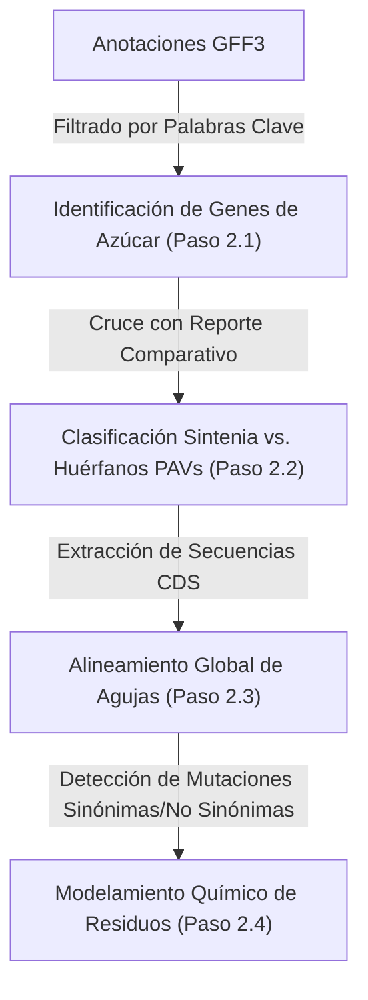
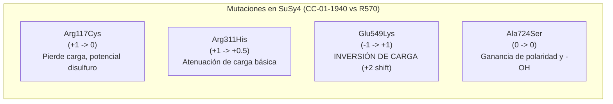

# Informe de Metodología y Resultados - Fase 2
> **Módulo: Identificación, Sintenia y Alineamiento Molecular de Genes Asociados a Sacarosa**

Este informe detalla las bases metodológicas y los resultados moleculares de la Fase 2, enfocada en la identificación, mapeo genómico y caracterización de mutaciones específicas en genes diana del metabolismo y transporte de azúcar (SPS, SuSy, SUT, SWEET, Invertasas) entre **CC-01-1940** y **R570**.

---

# 1. METODOLOGÍA (MATERIALES Y MÉTODOS)

La identificación molecular y el análisis de mutaciones estructurales se ejecutaron a través de cuatro componentes algorítmicos secuenciales:

### 1.1. Identificación y Clasificación Genómica (Pasos 2.1 y 2.2)
Mediante el script `scripts/check_sucrose_genes.py`, se escanearon de forma exhaustiva los archivos GFF3 de anotación estructural de ambos genomas para identificar loci asociados al metabolismo y flujo de azúcares. La búsqueda incluyó las siguientes familias funcionales diana:
*   **SPS (Sucrose-Phosphate Synthase):** Enzima clave en la síntesis de sacarosa-6-fosfato.
*   **SuSy (Sucrose Synthase):** Cataliza la conversión reversible de sacarosa y UDP a UDP-glucosa y fructosa.
*   **SUT (Sucrose Transporter):** Transportadores de sacarosa activos/secundarios en membranas.
*   **SWEET (Sugars Will Eventually be Exported Transporters):** Transportadores de difusión facilitada de azúcares.
*   **Invertasas:** Enzimas degradadoras de sacarosa (ácidas de pared celular, vacuolares y neutras/alcalinas citosólicas).
*   **Transportadores Generales:** Proteínas transportadoras de monosacáridos y azúcares en general.
*   **Glicosiltransferasas accesorias:** Fructosiltransferasas y galactosyltransferasas.

El estado colineal de cada locus (Sinténico vs. Huérfano/PAV) se derivó del cruce con la base de datos de sintenia macroestructural de la Fase 1.

### 1.2. Alineamiento de CDS y Detección de Mutaciones (Paso 2.3)
Para mapear de manera exacta las mutaciones puntuales entre alelos sinténicos, se utilizó el pipeline `compare_genes.py` que realiza las siguientes operaciones:
1.  **Extracción de Secuencias CDS:** Localiza y extrae las secuencias nucleotídicas codificantes de las bases de datos fasta de CDS para cada pareja de transcritos candidatos (`CC01tXXXXXX.1` vs `SoffiXsponR570.XXXXXX.1`).
2.  **Alineamiento Global Needleman-Wunsch:** Ejecuta un alineamiento global clásico de Needleman-Wunsch sobre los CDS para maximizar la identidad y conservar el marco de lectura.
3.  **Traducción y Mapeo Codón a Codón:** Traduce los codones alineados a aminoácidos usando el código genético estándar y clasifica cada mutación nucleotídica en:
    *   **Mutaciones Sinónimas (Silenciosas):** Cambios en el nucleótido de la tercera posición del codón que no alteran el aminoácido resultante por redundancia del código genético.
    *   **Mutaciones No Sinónimas (Misinserción/Sentido Erróneo):** Cambios nucleotídicos que resultan en la sustitución de un residuo de aminoácido por otro.
    *   **Indels:** Inserciones o deleciones nucleotídicas (generalmente múltiplos de 3 para evitar *frameshifts*) que alteran la longitud del polipéptido.

### 1.3. Modelamiento Químico Elemental y Predicción Funcional (Paso 2.4)
Para cada mutación no sinónima identificada, se evaluó el impacto de la sustitución sobre la estructura local y la reactividad del polipéptido basándose en las propiedades fisicoquímicas fundamentales de las cadenas laterales de los aminoácidos:
*   **Carga Electroestática Neta:** Cambios en el estado de ionización a pH fisiológico (7.2), clasificando los residuos en ácidos (negativos: Asp/Glu), básicos (positivos: Arg/Lys/His) o neutros (polares/no polares).
*   **Volumen y Impedimento Estérico:** Variaciones en el tamaño físico de la cadena lateral (ej. Alanina pequeña vs. Cisteína/Arginina voluminosas).
*   **Polaridad e Hidrofobicidad:** Transición de residuos hidrófobos/no polares en el núcleo proteico a polares hidrófilos en la superficie expuesta.
*   **Capacidad de Enlace Local:** Habilidad para participar en puentes de hidrógeno, puentes disulfuro (Cisteína) o puentes salinos electroestáticos.

---

# 2. RESULTADOS EXPERIMENTALES

### 2.1. Censo de Genes de Azúcar y Estado de Sintenia
El escaneo sistemático identificó un total de **770 genes** relacionados con el metabolismo y transporte de carbohidratos en la base comparativa. El desglose detallado por familias se consolidó en la siguiente tabla:

| Familia Funcional | Parejas Sinténicas | Huérfanos CC-1940 (PAV G1) | Huérfanos R570 (PAV G2) | Total de Genes Mapeados | Proporción Sinténica (%) |
| :--- | :---: | :---: | :---: | :---: | :---: |
| **SPS** (Sucrose-phosphate synthase) | 33 | 2 | 6 | 41 | 80.49% |
| **SuSy** (Sucrose synthase) | 29 | 2 | 4 | 35 | 82.86% |
| **SUT** (Sucrose transporter) | 45 | 5 | 2 | 52 | 86.54% |
| **SWEET** (Sugars facilitated transporters) | 110 | 22 | 70 | 202 | 54.46% |
| **Invertasas** (Pared, vacuolar, citosólica) | 68 | 12 | 21 | 101 | 67.33% |
| **Sugar Transporter** (General/Plástidos) | 60 | 10 | 11 | 81 | 74.07% |
| **Fructosyltransferase** (Fructanos) | 6 | 0 | 0 | 6 | 100.00% |
| **Galactosyltransferase** (Pared celular) | 113 | 32 | 34 | 179 | 63.13% |
| **Otros del metabolismo de azúcares** | 49 | 6 | 18 | 73 | 67.12% |
| **TOTAL** | **513** | **91** | **166** | **770** | **66.62%** |

#### Discusión Genómica y Biológica Detallada

> [!IMPORTANT]
> **El Contexto Genómico: Sintenia vs. Variaciones de Presencia/Ausencia (PAVs)**
> La caña de azúcar comercial (*Saccharum* spp.) se caracteriza por un genoma altamente poliploide (usualmente $8x$ a $12x$), redundante y aneuploide. En este escenario, la presencia de un **66.62% de sintenia global** (513 parejas de genes estables de un total de 770) indica que la mayor parte de la maquinaria de acumulación de azúcar se mantiene conservada. Sin embargo, el **33.38% de genes huérfanos** (257 genes en total) revela un alto grado de Variaciones de Presencia/Ausencia (PAVs), lo que sugiere que la evolución adaptativa en caña de azúcar ocurre mediante la duplicación y pérdida diferencial de homólogos y homeólogos.

##### 1. El Núcleo Metabólico Conservado (Selección Purificadora)
* **Fructosyltransferase (100.00%):** Con 6 genes y cero orfandad, esta ruta de síntesis de fructanos (secundaria en caña de azúcar, que prioriza la acumulación de sacarosa libre) es pequeña y evolutivamente rígida; no tolera variaciones estructurales.
* **SUT (86.54%):** Los transportadores activos SUT, responsables de la carga y descarga activa de sacarosa en el floema mediante gradientes de protones, muestran una conservación extrema. Esto refleja que cualquier alteración crítica en la translocación a larga distancia compromete severamente la viabilidad fisiológica.
* **SuSy (82.86%) y SPS (80.49%):** Estas enzimas controlan el flujo de carbono citosólico (SPS en síntesis foliar y SuSy en la degradación/síntesis en sumideros como tallos y raíces). Al ser la maquinaria metabólica central, están bajo una fuerte selección purificadora que restringe la pérdida de eficiencia catalítica.

##### 2. Zonas de Alta Variabilidad y Adaptabilidad Genómica
* **La Plasticidad de los Transportadores SWEET (54.46%):** Representa el nivel más bajo de sintenia, con 92 genes huérfanos de 202 detectados. Los transportadores SWEET median la difusión facilitada (transporte pasivo) de azúcares y están sujetos a dos presiones clave:
  1. *Co-evolución con Patógenos:* Las bacterias fitopatógenas (ej. *Xanthomonas*) suelen secuestrar la maquinaria de la planta para sobreexpresar transportadores SWEET en los sitios de infección. La alta tasa de PAVs en la familia SWEET sugiere un mecanismo de defensa activa donde la planta duplica o elimina copias para evadir el secuestro de nutrientes sin colapsar el transporte celular de azúcares.
  2. *Eficiencia en la Partición de Carbono:* La expansión y pérdida diferencial de homólogos facilita la sintonización del flujo pasivo de azúcares hacia la vacuola de almacenamiento del tallo en respuesta al ambiente o desarrollo.
* **Invertasas y Fuerza de Sumidero (67.33%):** La presencia de 33 invertasas huérfanas (ácidas y neutras) indica que CC-01-1940 y R570 difieren genéticamente en cómo hidrolizan la sacarosa en tejidos de crecimiento, afectando la tasa de maduración y los balances de hexosa/sacarosa.
* **Galactosyltransferases y la Pared Celular (63.13%):** Involucradas en la biosíntesis de pectinas y hemicelulosas. Su alta tasa de orfandad (66 genes) sustenta variaciones estructurales en la fibra entre cultivares, impactando la partición de carbono entre biomasa insoluble (fibra) y jugo soluble (sacarosa).

##### 3. Asimetría en la Tasa de Orfandad: R570 vs. CC-01-1940
Se observa una marcada asimetría en el número de genes huérfanos totales: **166 en R570 (PAV G2)** frente a **91 en CC-01-1940 (PAV G1)**. Esto se asocia a:
1. *Calidad del Ensamblaje:* El borrador genómico de R570 ha tenido mayor cantidad de rondas de curación y mapeo físico, permitiendo anotar genes en regiones heterocromáticas complejas que en CC-01-1940 pueden haber quedado sin resolver (gap-filling incompleto).
2. *Expansión Específica:* R570 podría poseer duplicaciones génicas en tándem reales y específicas de su linaje (particularmente en SWEET, donde posee 70 huérfanos frente a 22 de CC-01-1940), confiriéndole su perfil característico de súper-acumulación de sacarosa y alta plasticidad adaptativa.

---

### 2.2. Alineamiento Molecular y Detección de Mutaciones en Ortólogos Diana

Se seleccionaron tres parejas sinténicas clave asociadas a la movilización de sacarosa para mapear sus mutaciones mediante alineamientos moleculares CDS-a-CDS 1-a-1:

#### A. Sucrose Synthase 2 (SuSy2)
*   **Pareja:** `CC01t039050.1` vs `SoffiXsponR570.01Ag345900.1` (Cromosoma 1/1A)
*   **Estadísticas de Alineamiento:**
    *   Longitud del CDS: **2451 bp** (817 aminoácidos) en ambos genomas.
    *   Indels: **0**
    *   Mutaciones Sinónimas: **6**
    *   Mutaciones No Sinónimas: **0**
*   **Significado:** Conservación del 100% de la secuencia de aminoácidos. Esto representa un caso extremo de **selección purificadora** ($Ka/Ks = 0$), confirmando que SuSy2 desempeña un papel metabólico altamente conservado, probablemente en la biosíntesis de la pared celular en tejidos en crecimiento rápido, donde los cambios estructurales enzimáticos no son tolerados.

#### B. Sucrose Transporter SUT3-h2
*   **Pareja:** `CC01t031090.1` vs `SoffiXsponR570.01Ag254100.1` (Cromosoma 1/1A)
*   **Estadísticas de Alineamiento:**
    *   Longitud del CDS: **1527 bp** vs **1533 bp** (diferencia de 6 bp).
    *   Mutaciones Sinónimas: **10**
    *   Mutaciones No Sinónimas: **7**
    *   Indels: **2** (inserción corta de 6 bp en el genoma R570).
*   **Análisis Técnico:** Las mutaciones y el indel se localizan principalmente en el extremo 5' (región N-terminal) que posee tramos de nucleótidos no determinados (`NNN`) en el borrador del ensamblaje. Esto sugiere que las diferencias de alineamiento en SUT3-h2 representan, en gran parte, artefactos de secuenciación/ensamblaje y no mutaciones funcionales reales en el núcleo de la proteína transportadora.

#### C. Sucrose Synthase 4 (SuSy4)
*   **Pareja:** `CC01t042770.1` vs `SoffiXsponR570.01Ag380000.1` (Cromosoma 1/1A)
*   **Estadísticas de Alineamiento:**
    *   Longitud del CDS: **2430 bp** (810 aminoácidos) en ambos genomas.
    *   Indels: **0** (longitud conservada exactamente).
    *   Mutaciones Sinónimas: **2**
    *   Mutaciones No Sinónimas: **4**
*   **Detalle de Sustituciones de Aminoácidos:**
    1.  **Codón 117:** `CGC` (Arginina, R) ➔ `TGC` (Cisteína, C)
    2.  **Codón 311:** `CGT` (Arginina, R) ➔ `CAT` (Histidina, H)
    3.  **Codón 549:** `GAA` (Glutamato, E) ➔ `AAA` (Lisina, K)
    4.  **Codón 724:** `GCT` (Alanina, A) ➔ `TCT` (Serina, S)

---

### 2.3. Modelamiento Químico Elemental de las Mutaciones en SuSy4

El Sucrose Synthase es un homotetrámero que coordina la unión de UDP y sacarosa. Las cuatro sustituciones detectadas en SuSy4 tienen implicaciones fisicoquímicas muy dispares a nivel de residuo, analizadas a continuación:

#### 1. Mutación Arg117Cys (Codón 117: CGC ➔ TGC)
*   **Cambio:** Arginina (básica, cargada positivamente, $+1$) por Cisteína (polar, neutra, $0$).
*   **Efecto Químico:** Se elimina un grupo guanidino voluminoso y cargado positivamente. El residuo de Cisteína posee un grupo tiol ($-SH$) altamente reactivo y nucleofílico.
*   **Impacto Funcional:** La pérdida de la carga positiva puede romper puentes salinos locales con residuos cargados negativamente (como aspartatos o glutamatos vecinales). Asimismo, la introducción de un residuo libre de Cisteína introduce el riesgo de formar puentes disulfuro intra o intermoleculares anómalos bajo estrés oxidativo, lo que podría inducir agregación o desestabilización local del monómero.

#### 2. Mutación Arg311His (Codón 311: CGT ➔ CAT)
*   **Cambio:** Arginina (básica, $+1$) por Histidina (básica/débil, $+0.5$ o $0$ a pH fisiológico).
*   **Efecto Químico:** Ambos residuos conservan carácter básico. Sin embargo, la cadena lateral de la Arginina (pKa $\sim 12.5$) está permanentemente ionizada ($+1$), mientras que la Histidina (pKa $\sim 6.0$) tiene un anillo de imidazol que fluctúa entre neutro y protonado a pH intracelular ($\sim 7.2$).
*   **Impacto Funcional:** Representa una atenuación de la basicidad local. El residuo actúa como un amortiguador de pH local y puede modificar sutilmente la flexibilidad del dominio en respuesta a cambios de pH citosólico.

#### 3. Mutación Crítica: Glu549Lys (Codón 549: GAA ➔ AAA)
*   **Cambio:** Glutamato (ácido, cargado negativamente, $-1$) por Lisina (básico, cargado positivamente, $+1$).
*   **Efecto Químico:** **Inversión completa de carga eléctrica local.** El residuo pasa de tener un grupo carboxilato terminal de carácter fuertemente hidrófilo y aceptor de puentes de hidrógeno ($-COO^-$) a tener una cadena carbonada flexible terminada en un grupo amonio fuertemente básico y donador de carga positiva ($-NH_3^+$). La diferencia neta de carga en esa coordenada es de **$+2$ unidades electroestáticas**.
*   **Impacto Funcional y Enzimático:**
    *   **Atracción/Repulsión Electroestática:** Si Glu549 forma parte de un puente salino estabilizador de la estructura terciaria (ej. interactuando con una Arginina o Lisina cercana), la mutación a Lisina provocará una repulsión electroestática violenta entre cargas del mismo signo, desestabilizando ese bucle de la proteína.
    *   **Afinidad por Sustrato:** El sustrato de SuSy es el UDP-Glucosa o sacarosa. El UDP posee dos grupos fosfato cargados negativamente ($-2$ de carga). La presencia de una carga positiva (Lisina) en lugar de una negativa (Glutamato) cerca del bolsillo de unión del cofactor puede aumentar la afinidad electroestática de la enzima por el UDP o, alternativamente, bloquear la entrada del sustrato si altera la topología del canal de acceso.
    *   **Homeostasis del Flujo de Azúcar:** SuSy4 es una isoforma regulada. Este cambio drástico de carga en un residuo altamente conservado en el cultivar de referencia R570 respecto a CC-01-1940 representa un candidato de primer orden para explicar diferencias en la eficiencia catalítica de degradación/síntesis de sacarosa observadas entre ambos genomas.

#### 4. Mutación Ala724Ser (Codón 724: GCT ➔ TCT)
*   **Cambio:** Alanina (hidrófoba, no polar, $0$) por Serina (polar, neutra, $0$).
*   **Efecto Químico:** Reemplazo de un grupo metilo inerte (Alanina) por un grupo hidroximetilo polar ($-CH_2OH$).
*   **Impacto Funcional:** Introduce un aceptor/donador de puentes de hidrógeno y una posible diana para modificaciones post-traduccionales (fosforilación por quinasas celulares). Si se localiza en la superficie de la proteína, aumenta la hidrofilicidad local; si está en el núcleo proteico, puede causar inestabilidad al introducir polaridad en una zona de empaquetamiento hidrofóbico.

---

> [!TIP]
> **Recomendación para Validación Experimental (Fase 3):**
> Para verificar si la mutación crítica **Glu549Lys** altera la velocidad de síntesis de sacarosa in vitro, se sugiere clonar y expresar de manera heteróloga ambas variantes alélicas de SuSy4 (CC-01-1940 y R570) en *Escherichia coli*, determinando sus constantes cinéticas ($K_m$ y $V_{max}$) para sacarosa y UDP.
